# Trabajo Práctico Integrador (TPI) Organización Empresarial | Tecnicatura Universitaria en Programación (TUP)
## 🤖 Sistema Automatizado de Gestión de Vacaciones (Chatbot Simulado)

#Este repositorio contiene la entrega del proyecto integrador, desarrollado íntegramente en un entorno híbrido de **Google Colab** y versionado en **GitHub**. El objetivo principal es actuar como consultores tecnológicos, tomando un proceso manual e ineficiente para transformarlo en una solución automatizada mediante un chatbot basado en una **Máquina de Estados Finitos (FSM)** y alineado de forma estricta a un modelo de procesos **BPMN 2.0**.

---

## 📊 1. Modelado de Negocio (El "Qué")

### Identificación del Proceso
El proceso seleccionado es la **Gestión de Solicitud de Vacaciones de Empleados**. Tradicionalmente, este trámite requiere formularios físicos, correos electrónicos cruzados y consultas manuales al departamento de Recursos Humanos, generando demoras.

### Flujo del Proceso (Arquitectura Lógica)
El flujo automatizado se rige por el siguiente diseño lógico (*To-Be*), el cual divide las responsabilidades del usuario y el sistema:

```mermaid
graph TD
    subgraph PoolToBe [POOL: GESTIÓN DE VACACIONES AUTOMATIZADA]
        
        subgraph LaneUsuarioToBe [LANE 1: CARRIL DE USUARIO - Empleado]
            Inicio_ToBe([Envía comando /vacaciones]) --> IngresaLegajo[Introduce Número de Legajo]
            SolicitaDias[Indica Cantidad de Días Deseados]
            Fin_Ok([Recibe Confirmación Exitosa])
            Fin_Error1([Recibe Alerta: ID Inválido])
            Fin_Error2([Recibe Alerta: Saldo Insuficiente])
        end
        
        subgraph LaneSistemaToBe [LANE 2: CARRIL DE SISTEMA - Chatbot WhatsApp]
            IngresaLegajo --> ValidarLegajo[FSM: Captura Mensaje y Valida Tipo]
            ValidarLegajo --> Gateway_ID{¿Legajo Existe?}
            
            Gateway_ID -- No --> Rechazo_ID[Emite Error y Reinicia Contexto]
            Rechazo_ID --> Fin_Error1
            
            Gateway_ID -- Sí --> ConsultarBD[Consulta Saldo en Persistencia]
            ConsultarBD --> SolicitaDias
            
            SolicitaDias --> ValidarCredito[FSM: Procesa Entrada de Días]
            ValidarCredito --> Gateway_Saldo{¿Días Solicitados <= Saldo?}
            
            Gateway_Saldo -- No --> Rechazo_Saldo[Emite Error y Aborta Trámite]
            Rechazo_Saldo --> Fin_Error2
            
            Gateway_Saldo -- Sí --> ImpactarBD[Mutación de Datos: Resta Días]
            ImpactarBD --> RegistrarHistorial[Registra Solicitud como APROBADA]
            RegistrarHistorial --> ConfirmacionExitosa[Emite Notificación de Éxito]
            ConfirmacionExitosa --> Fin_Ok
        end
        
    end

    style Inicio_ToBe fill:#85C1E9,stroke:#333,stroke-width:2px
    style Gateway_ID fill:#F4D03F,stroke:#333,stroke-width:2px
    style Gateway_Saldo fill:#F4D03F,stroke:#333,stroke-width:2px
    style ImpactarBD fill:#58D68D,stroke:#27AE60,stroke-width:2px
    style Fin_Ok fill:#58D68D,stroke:#27AE60,stroke-width:2px
    style Fin_Error1 fill:#EC7063,stroke:#CB4335,stroke-width:2px
    style Fin_Error2 fill:#EC7063,stroke:#CB4335,stroke-width:2px
```

---

## 🛠️ 2. Arquitectura y Programación (El "Cómo")

### Selección del Stack Tecnológico
* **Entorno de Ejecución:** Google Colab (Python 3.10+) para garantizar una evaluación inmediata sin configuraciones locales.
* **Interfaz de Usuario:** Simulación interactiva por consola (`input/print`), replicando la experiencia de un bot conversacional (WhatsApp/Telegram).
* **Persistencia de Datos:** Estructura en archivo de texto plano `mock_database.json` actuando como Base de Datos Embebida.

### Coherencia Estructural (BPMN a Código)
Cada decisión reflejada en las compuertas del diagrama se implementó mediante estructuras condicionales lógicas (`if/elif/else`), asegurando que el software funcione estrictamente como un reflejo del modelo de negocios.

---

## 📋 3. Documentación y Calidad (Pautas de Evaluación)

### A. Diccionario de Datos (Persistencia)
Estructura de la base de datos simulada (`mock_database.json`):

#### Entidad: `empleados`

| Campo | Tipo | Descripción | Ejemplo |
| :--- | :--- | :--- | :--- |
| `legajo` (PK) | String | Código identificador único del trabajador. | `"1001"` |
| `nombre` | String | Nombre y apellido completo del empleado. | `"Juan Pérez"` |
| `saldo_dias` | Integer | Cantidad de días hábiles de vacaciones disponibles. | `14` |
| `estado_fsm` | String | Estado actual del hilo conversacional del usuario. | `"INICIO"` |

#### Entidad: `solicitudes_aprobadas`

| Campo | Tipo | Descripción | Ejemplo |
| :--- | :--- | :--- | :--- |
| `legajo` | String | Relación con el empleado solicitante. | `"1001"` |
| `nombre` | String | Nombre copiado al momento del impacto histórico. | `"Juan Pérez"` |
| `dias_solicitados` | Integer | Cantidad de días aprobados y descontados. | `5` |
| `estado` | String | Estado final de la transacción. | `"APROBADA"` |

---

### B. Manual de Usuario (Simulación del Bot)
El chatbot funciona mediante comandos e ingresos secuenciales ordenados por la FSM:

1. **Iniciar Simulación:** Ejecutar la celda correspondiente al código del chatbot.
2. **Comando Global:** Escribir `salir` en cualquier paso para abortar el flujo, limpiar la memoria intermedia y reiniciar la sesión del bot.
3. **Paso 1 - Identificación:** Introducir un legajo válido (Ej: `1001`, `1002`). El sistema recuperará el saldo en tiempo real de la persistencia JSON.
4. **Paso 2 - Solicitud:** Indicar numéricamente los días requeridos. El sistema evaluará el negocio y confirmará el éxito o rechazará la transacción por saldo insuficiente.

---

### C. Gestión de la Complejidad y Robustez (El "Camino Infeliz")
El simulador implementa controles estrictos ante los fallos comunes de los usuarios para evitar que la aplicación se interrumpa (Rudeza del software):

* **Excepción de Tipo de Datos (Rudeza):** Si el bot solicita días (esperando un entero) y el usuario ingresa caracteres de texto (Ej: `"cinco"` o `"5a"`), la FSM atrapa el error mediante validación de cadenas (`.isdigit()`), emite una advertencia amigable y mantiene al usuario en el estado actual sin romper la ejecución.
* **Excepción de Regla de Negocio (Gateway_ID):** Si el número de legajo no figura en el archivo JSON, la máquina deniega el acceso, informa el error y solicita nuevamente el dato, impidiendo consultas anónimas.
* **Excepción de Saldo (Gateway_Saldo):** Si el empleado pide más días de los disponibles, el sistema procesa el desborde, deniega la mutación en la base de datos y aborta el trámite de forma segura.

---

## 🤖 4. Registro de Consultas a Herramientas de IA

Para dar cumplimiento a los requerimientos de la cátedra sobre el uso transparente de Inteligencia Artificial como copiloto de desarrollo, se detalla la bitácora de ingeniería:

* **Prompt Utilizado para Estructura de Datos:**
  > *"Actúa como un Ingeniero de Software. Necesito modelar un archivo JSON simulado que funcione como base de datos para un proceso de vacaciones. Debe contener legajos como claves primarias, nombres, saldos de días enteros y un estado de sesión. Proporcióname un código limpio en Python para generarlo."*
* **Prompt Utilizado para la Robustez (Camino Infeliz):**
  > *"¿Cómo puedo evitar que mi máquina de estados en Python falle por completo si el usuario introduce texto en un input que espera un valor puramente numérico para procesar días de vacaciones? Aplica técnicas de control de flujos de excepción."*
* **Justificación de Elección:** Se utilizó IA generativa exclusivamente para acelerar el diseño de plantillas sintácticas y robustecer los algoritmos de captura de errores, garantizando que el diseño final responda exactamente al contrato conceptual definido en el BPMN.
