# 📊 Modelado de Negocio - Proceso To-Be (Gestión de Vacaciones)

Este archivo contiene la especificación del proceso optimizado y automatizado mediante el uso del Chatbot conversacional, codificado bajo el estándar de diagramación BPMN 2.0 y representado de forma nativa mediante la sintaxis **Mermaid**.

## 🗺️ Diagrama de Procesos (BPMN 2.0 Moderno)

```mermaid
graph TD
    subgraph PoolToBe [POOL: GESTIÓN DE VACACIONES AUTOMATIZADA]
        
        %% Carril del Usuario (Eventos y Tareas de Entrada)
        subgraph LaneUsuarioToBe [LANE 1: CARRIL DE USUARIO - Empleado]
            Inicio_ToBe([Envía comando /vacaciones]) --> IngresaLegajo[Introduce Número de Legajo]
            SolicitaDias[Indica Cantidad de Días Deseados]
            Fin_Ok([Recibe Confirmación Exitosa])
            Fin_Error1([Recibe Alerta: ID Inválido])
            Fin_Error2([Recibe Alerta: Saldo Insuficiente])
        end
        
        %% Carril del Sistema (Procesamiento Interno, FSM y Compuertas)
        subgraph LaneSistemaToBe [LANE 2: CARRIL DE SISTEMA - Chatbot WhatsApp]
            IngresaLegajo --> ValidarLegajo[FSM: Captura Mensaje y Valida Tipo]
            ValidarLegajo --> Gateway_ID{¿Legajo Existe?}
            
            Gateway_ID -- No --> Rechazo_ID[Emite Error y Reinicia Contexto]
            Rechazo_ID --> Fin_Error1
            
            Gateway_ID -- Sí --> ConsultarBD[Consulta Saldo en Persistencia]
            ConsultarBD --> SolicitaDias
            
            SolicitaDias --> ValidarCredito[FSM: Procesa Entrada de Días]
            ValidarCredito --> Gateway_Saldo{¿Días Solicitados <= Saldo?}
            
            Gateway_Saldo -- No --> Rechazo_Saldo[Emite Error y Aborta Trámite]
            Rechazo_Saldo --> Fin_Error2
            
            Gateway_Saldo -- Sí --> ImpactarBD[Mutación de Datos: Resta Días]
            ImpactarBD --> RegistrarHistorial[Registra Solicitud como APROBADA]
            RegistrarHistorial --> ConfirmacionExitosa[Emite Notificación de Éxito]
            ConfirmacionExitosa --> Fin_Ok
        end
        
    end

    %% Estilos Visuales del Escenario Automatizado (BPMN Moderno)
    style Inicio_ToBe fill:#85C1E9,stroke:#333,stroke-width:2px
    style Gateway_ID fill:#F4D03F,stroke:#333,stroke-width:2px
    style Gateway_Saldo fill:#F4D03F,stroke:#333,stroke-width:2px
    style ImpactarBD fill:#58D68D,stroke:#27AE60,stroke-width:2px
    style Fin_Ok fill:#58D68D,stroke:#27AE60,stroke-width:2px
    style Fin_Error1 fill:#EC7063,stroke:#CB4335,stroke-width:2px
    style Fin_Error2 fill:#EC7063,stroke:#CB4335,stroke-width:2px
```

---

## 🔍 Análisis de Coherencia de Negocio

El diseño estructurado en este andarivel de servicios garantiza que:
1. **Separación de Responsabilidades**: Las actividades del empleado se mantienen puramente en el canal de interfaz de usuario (`Lane 1`), mientras que la lógica transaccional y el control de persistencia se ejecutan en el carril automatizado del chatbot (`Lane 2`).
2. **Control Transaccional**: La mutación de datos (`ImpactarBD`) ocurre exclusivamente de forma posterior a superar con éxito las compuertas restrictivas de validación de identidad y verificación dinámica de saldos presupuestarios de días hábiles.
